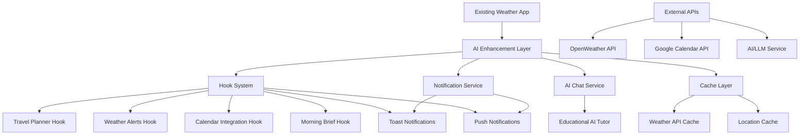

# Design Document

## Overview

This design document outlines the architecture for enhancing the existing weather app with AI-powered productivity features and Kiro hooks. The enhancements will integrate seamlessly with the current React/Next.js application while adding intelligent notifications, automated weather monitoring, calendar integration, and educational capabilities. All new features will be implemented as non-intrusive additions that preserve the existing UI and functionality.

## Architecture

### High-Level Architecture



### System Integration Points

1. **Non-Intrusive Enhancement**: All new features will be implemented as separate services that hook into existing weather data flows
2. **Notification Layer**: Utilizes existing toast system and adds push notification capabilities
3. **Cache Integration**: Wraps existing API calls with caching layer for improved performance
4. **Hook Architecture**: Implements Kiro hooks as separate modules that can be enabled/disabled independently

## Components and Interfaces

### Core Services

#### 1. WeatherIntelligenceService
```typescript
interface WeatherIntelligenceService {
  analyzeWeatherForTravel(location: string, forecast: WeatherData): TravelAdvice
  generateMorningBrief(location: string, forecast: WeatherData): MorningBrief
  detectWeatherAlerts(forecast: WeatherData): WeatherAlert[]
  checkOutdoorEventWeather(eventDate: Date, location: string): EventWeatherAdvice
}
```

#### 2. NotificationService
```typescript
interface NotificationService {
  showTravelTip(tip: string): void
  sendWeatherAlert(alert: WeatherAlert): void
  sendMorningBrief(brief: MorningBrief): void
  sendEventWeatherAdvice(advice: EventWeatherAdvice): void
}
```

#### 3. CacheService
```typescript
interface CacheService {
  get<T>(key: string): T | null
  set<T>(key: string, value: T, ttl: number): void
  invalidate(key: string): void
  generateCacheKey(endpoint: string, params: Record<string, any>): string
}
```

#### 4. AITutorService
```typescript
interface AITutorService {
  askQuestion(question: string): Promise<string>
  getWeatherExplanation(concept: string): Promise<string>
  generateContextualResponse(weatherData: WeatherData, question: string): Promise<string>
}
```

#### 5. MoodPlaylistService
```typescript
interface MoodPlaylistService {
  generatePlaylistSuggestion(weatherCondition: string): PlaylistSuggestion
  getSpotifyPlaylist(mood: string): Promise<SpotifyPlaylist>
  getYouTubePlaylist(mood: string): Promise<YouTubePlaylist>
}
```

#### 6. DisasterAlertService
```typescript
interface DisasterAlertService {
  checkForExtremeWeather(weatherData: WeatherData): DisasterAlert[]
  generateSafetyTips(alertType: string): string[]
  sendEmergencyAlert(alert: DisasterAlert): void
}
```

### Hook Implementations

#### 1. Smart Travel Planner Hook
- **Trigger**: City search events
- **Logic**: Analyze forecast for rain/extreme weather
- **Output**: Side notification with packing tips
- **Integration**: Hooks into existing search functionality

#### 2. Weather Alerts Hook
- **Trigger**: Hourly cron job
- **Logic**: Check 6-hour forecast for rain/snow
- **Output**: Push notification
- **Integration**: Background service with notification system

#### 3. Calendar Integration Hook
- **Trigger**: Google Calendar event creation/modification
- **Logic**: Check weather for outdoor events
- **Output**: Rescheduling suggestions
- **Integration**: Google Calendar API webhook

#### 4. Morning Brief Hook
- **Trigger**: Daily at 7:00 AM
- **Logic**: Generate personalized weather summary
- **Output**: Morning notification
- **Integration**: Scheduled task with notification system

#### 5. Mood-Based Playlist Hook
- **Trigger**: Weather data updates
- **Logic**: Analyze weather conditions for mood matching
- **Output**: Playlist widget below forecast
- **Integration**: Spotify/YouTube API integration

#### 6. Disaster Alert Hook
- **Trigger**: Extreme weather detection
- **Logic**: Monitor for storms, floods, heatwaves
- **Output**: Emergency alert notifications with safety tips
- **Integration**: High-priority notification system

## Data Models

### Weather Intelligence Models

```typescript
interface TravelAdvice {
  location: string
  weatherCondition: string
  advice: string
  packingTips: string[]
  severity: 'low' | 'medium' | 'high'
}

interface WeatherAlert {
  type: 'rain' | 'snow' | 'storm' | 'extreme_temp'
  severity: 'low' | 'medium' | 'high'
  timeframe: string
  message: string
  recommendations: string[]
}

interface MorningBrief {
  location: string
  temperature: number
  condition: string
  highlights: string[]
  recommendations: string[]
  uvAdvice?: string
  precipitationTiming?: string
}

interface EventWeatherAdvice {
  eventDate: Date
  weatherSuitability: 'good' | 'fair' | 'poor'
  recommendation: 'proceed' | 'reschedule' | 'indoor_alternative'
  alternativeDates?: Date[]
  message: string
}

interface PlaylistSuggestion {
  weatherCondition: string
  mood: string
  playlistName: string
  description: string
  spotifyUrl?: string
  youtubeUrl?: string
}

interface DisasterAlert {
  type: 'storm' | 'flood' | 'heatwave' | 'hurricane' | 'tornado'
  severity: 'watch' | 'warning' | 'emergency'
  location: string
  startTime: Date
  endTime?: Date
  safetyTips: string[]
  emergencyContacts?: string[]
}
```

### Cache Models

```typescript
interface CacheEntry<T> {
  data: T
  timestamp: number
  ttl: number
}

interface WeatherCacheConfig {
  currentWeatherTTL: number // 10 minutes
  forecastTTL: number // 30 minutes
  locationTTL: number // 24 hours
  uvDataTTL: number // 15 minutes
}
```

## Error Handling

### Graceful Degradation Strategy

1. **API Failures**: Fall back to cached data or mock data to maintain functionality
2. **AI Service Failures**: Provide static weather advice templates
3. **Notification Failures**: Log errors and retry with exponential backoff
4. **Calendar Integration Failures**: Continue with weather monitoring, skip calendar features

### Error Recovery Mechanisms

```typescript
interface ErrorRecoveryService {
  handleAPIFailure(endpoint: string, error: Error): Promise<any>
  handleNotificationFailure(notification: any, error: Error): Promise<void>
  handleCacheFailure(operation: string, error: Error): void
  logError(context: string, error: Error): void
}
```

## Testing Strategy

### Unit Testing
- **Services**: Test each service independently with mocked dependencies
- **Hooks**: Test hook logic with simulated triggers and data
- **Cache**: Test cache operations, TTL expiration, and invalidation
- **AI Integration**: Test with mocked AI responses

### Integration Testing
- **Weather API Integration**: Test with real API calls and caching
- **Notification System**: Test toast and push notification delivery
- **Calendar Integration**: Test with Google Calendar API sandbox
- **End-to-End Workflows**: Test complete user scenarios

### Performance Testing
- **Cache Performance**: Measure cache hit rates and response times
- **Background Jobs**: Test hook execution times and resource usage
- **API Rate Limiting**: Test behavior under API rate limits
- **Memory Usage**: Monitor memory consumption of caching and background services

### Testing Tools and Frameworks
- **Jest**: Unit and integration testing
- **React Testing Library**: Component testing
- **MSW (Mock Service Worker)**: API mocking
- **Playwright**: End-to-end testing

## Implementation Architecture

### File Structure
```
.kiro/
├── specs/
│   └── ai-weather-productivity-enhancements/
├── hooks/
│   ├── travel-planner-hook.ts
│   ├── weather-alerts-hook.ts
│   ├── calendar-integration-hook.ts
│   ├── morning-brief-hook.ts
│   ├── mood-playlist-hook.ts
│   └── disaster-alert-hook.ts
└── steering/
    └── weather-ai-guidelines.md

lib/
├── services/
│   ├── weather-intelligence.ts
│   ├── notification-service.ts
│   ├── cache-service.ts
│   ├── ai-tutor-service.ts
│   ├── mood-playlist-service.ts
│   └── disaster-alert-service.ts
├── hooks/
│   └── use-weather-cache.ts
└── utils/
    ├── weather-analysis.ts
    └── notification-helpers.ts

components/
├── ai-chat/
│   ├── weather-tutor-chat.tsx
│   └── chat-interface.tsx
├── notifications/
│   ├── weather-notification.tsx
│   └── disaster-alert.tsx
└── widgets/
    └── mood-playlist-widget.tsx
```

### Technology Stack Integration
- **React/Next.js**: Existing framework, no changes required
- **TypeScript**: Maintain type safety across all new components
- **Tailwind CSS**: Use existing styling system for new UI elements
- **Radix UI**: Leverage existing component library for consistency
- **Local Storage**: Cache management and user preferences
- **Web APIs**: Push notifications, service workers for background tasks

### Performance Considerations
- **Lazy Loading**: AI chat component loaded only when needed
- **Debounced API Calls**: Prevent excessive API requests during user interactions
- **Efficient Caching**: Smart cache invalidation and memory management
- **Background Processing**: Non-blocking execution of hooks and notifications

### Security Considerations
- **API Key Management**: Secure storage and rotation of API keys
- **Data Privacy**: Minimal data collection, local storage preference
- **Calendar Permissions**: Proper OAuth scope management
- **Input Validation**: Sanitize all user inputs to AI services
- **Rate Limiting**: Implement client-side rate limiting for AI requests