# Design Document

## Overview

This design document outlines the comprehensive transformation of the existing weather app into "NexaFlow" - a full-featured productivity platform. The design maintains all existing weather functionality while adding analytics, voice assistance, collaboration, gamification, and AI-powered features. The architecture emphasizes modularity, allowing new features to integrate seamlessly without disrupting the current weather and eco-travel capabilities.

## Architecture

### High-Level System Architecture

```mermaid
graph TB
    A[NexaFlow App Shell] --> B[Weather Module - Preserved]
    A --> C[Analytics Dashboard]
    A --> D[Voice Assistant]
    A --> E[Collaboration Hub]
    A --> F[Gamification Engine]
    A --> G[AI Suggestion Engine]
    
    B --> H[UV Index Display]
    B --> I[Eco Travel Planner]
    B --> J[City Search]
    
    C --> K[Chart Components]
    C --> L[Data Aggregation]
    C --> M[Export Service]
    
    D --> N[Speech Recognition]
    D --> O[Voice Commands]
    D --> P[Audio Feedback]
    
    E --> Q[User Management]
    E --> R[Shared Spaces]
    E --> S[Real-time Sync]
    
    F --> T[Badge System]
    F --> U[Achievement Engine]
    F --> V[Streak Tracking]
    
    G --> W[Task Suggestions]
    G --> X[Time Optimization]
    G --> Y[Pattern Analysis]
    
    Z[Theme System] --> AA[Teal-Purple Gradient]
    Z --> BB[Dark/Light Modes]
    Z --> CC[Boost Mode Easter Egg]
    
    DD[Offline System] --> EE[Local Storage]
    DD --> FF[Sync Manager]
    DD --> GG[Conflict Resolution]
```



### Modular Integration Strategy

The design follows a modular approach where new features are implemented as separate modules that integrate with the existing weather app through:

1. **Preserved Core**: All existing weather functionality remains in dedicated modules
2. **Feature Modules**: New productivity features as independent, pluggable modules
3. **Shared Services**: Common services (theme, notifications, data) used across modules
4. **Integration Layer**: Coordination between weather features and new productivity features

## Components and Interfaces

### Core Application Shell

#### 1. NexaFlowApp Component
```typescript
interface NexaFlowApp {
  currentModule: 'weather' | 'analytics' | 'collaboration' | 'settings'
  themeMode: 'light' | 'dark' | 'custom' | 'boost'
  user: UserProfile
  offlineMode: boolean
  voiceAssistantActive: boolean
}
```

#### 2. Navigation System
```typescript
interface NavigationService {
  navigateToModule(module: string): void
  preserveWeatherState(): void
  getActiveModule(): string
  registerModuleRoutes(routes: ModuleRoute[]): void
}
```

### Theme and Visual System

#### 1. ThemeService
```typescript
interface ThemeService {
  currentTheme: ThemeConfig
  applyTheme(theme: ThemeType): void
  createCustomTheme(colors: ColorPalette): ThemeConfig
  activateBoostMode(): void
  saveThemePreference(theme: ThemeConfig): void
}

interface ThemeConfig {
  name: string
  colors: {
    primary: string // Teal to Purple gradient
    secondary: string
    background: string
    surface: string
    text: string
    accent: string
  }
  animations: AnimationConfig
  boostMode?: BoostModeConfig
}
```

### Analytics and Reporting

#### 1. AnalyticsService
```typescript
interface AnalyticsService {
  trackUserActivity(activity: UserActivity): void
  generateReport(timeRange: TimeRange, type: ReportType): AnalyticsReport
  getChartData(chartType: ChartType, filters: AnalyticsFilters): ChartData
  exportReport(format: 'pdf' | 'excel', report: AnalyticsReport): Promise<Blob>
}

interface UserActivity {
  type: 'weather_search' | 'travel_plan' | 'voice_command' | 'collaboration'
  timestamp: Date
  metadata: Record<string, any>
  location?: string
}

interface AnalyticsReport {
  summary: ReportSummary
  charts: ChartData[]
  timeRange: TimeRange
  insights: AIInsight[]
}
```

#### 2. Chart Components
```typescript
interface ChartComponent {
  type: 'line' | 'bar' | 'pie' | 'area'
  data: ChartData
  interactive: boolean
  responsive: boolean
  exportable: boolean
}
```

### Voice Assistant System

#### 1. VoiceAssistantService
```typescript
interface VoiceAssistantService {
  startListening(): void
  stopListening(): void
  processCommand(command: string): Promise<VoiceResponse>
  speak(text: string): void
  registerCommandHandler(pattern: string, handler: CommandHandler): void
}

interface VoiceCommand {
  pattern: RegExp
  action: string
  parameters?: Record<string, any>
  confidence: number
}

interface VoiceResponse {
  success: boolean
  message: string
  action?: AppAction
  audioResponse?: string
}
```

### Gamification Engine

#### 1. GamificationService
```typescript
interface GamificationService {
  awardBadge(userId: string, badgeId: string): void
  updateStreak(userId: string, activity: string): void
  checkAchievements(userId: string, activity: UserActivity): Achievement[]
  getUserProgress(userId: string): UserProgress
}

interface Badge {
  id: string
  name: string
  description: string
  icon: string
  rarity: 'common' | 'rare' | 'epic' | 'legendary'
  criteria: BadgeCriteria
}

interface Achievement {
  id: string
  title: string
  description: string
  points: number
  unlockedAt: Date
  category: 'weather' | 'productivity' | 'collaboration' | 'consistency'
}
```

### AI Suggestion Engine

#### 1. AISuggestionService
```typescript
interface AISuggestionService {
  generateTaskSuggestions(weather: WeatherData, userContext: UserContext): TaskSuggestion[]
  optimizeSchedule(tasks: Task[], constraints: ScheduleConstraints): OptimizedSchedule
  analyzeProductivityPatterns(userId: string): ProductivityInsights
  personalizeNotifications(userId: string, context: NotificationContext): PersonalizedNotification
}

interface TaskSuggestion {
  task: string
  reasoning: string
  weatherDependency: boolean
  priority: 'low' | 'medium' | 'high'
  estimatedDuration: number
  optimalTime?: TimeSlot
}
```

### Collaboration System

#### 1. CollaborationService
```typescript
interface CollaborationService {
  createSharedSpace(name: string, members: string[]): SharedSpace
  joinSpace(spaceId: string, userId: string): void
  shareWeatherData(spaceId: string, weatherData: WeatherData): void
  syncUserProgress(spaceId: string, progress: UserProgress): void
  sendTeamNotification(spaceId: string, message: string): void
}

interface SharedSpace {
  id: string
  name: string
  members: TeamMember[]
  sharedData: SharedData
  permissions: SpacePermissions
  createdAt: Date
}
```

### Offline System

#### 1. OfflineService
```typescript
interface OfflineService {
  enableOfflineMode(): void
  syncWhenOnline(): Promise<SyncResult>
  cacheData(key: string, data: any): void
  getCachedData(key: string): any
  handleConflicts(conflicts: DataConflict[]): ConflictResolution[]
}

interface SyncResult {
  success: boolean
  conflictsResolved: number
  dataUpdated: string[]
  errors: SyncError[]
}
```

## Data Models

### User and Progress Models

```typescript
interface UserProfile {
  id: string
  name: string
  email: string
  preferences: UserPreferences
  progress: UserProgress
  collaborations: string[] // Space IDs
  achievements: Achievement[]
  streaks: StreakData[]
}

interface UserProgress {
  level: number
  totalPoints: number
  badges: Badge[]
  weeklyActivity: ActivitySummary
  productivityScore: number
  weatherQueriesCount: number
}

interface UserPreferences {
  theme: ThemeConfig
  notifications: NotificationSettings
  voice: VoiceSettings
  privacy: PrivacySettings
  defaultLocation?: string
}
```

### Analytics Models

```typescript
interface ChartData {
  labels: string[]
  datasets: Dataset[]
  type: ChartType
  options: ChartOptions
}

interface Dataset {
  label: string
  data: number[]
  backgroundColor?: string | string[]
  borderColor?: string
  borderWidth?: number
}

interface AnalyticsFilters {
  timeRange: TimeRange
  activityTypes: string[]
  locations?: string[]
  users?: string[] // For collaboration analytics
}
```

## Error Handling

### Comprehensive Error Management

```typescript
interface ErrorHandlingService {
  handleVoiceError(error: VoiceError): void
  handleOfflineError(error: OfflineError): void
  handleCollaborationError(error: CollaborationError): void
  handleAnalyticsError(error: AnalyticsError): void
  preserveWeatherFunctionality(error: any): void
}
```

### Graceful Degradation Strategy

1. **Voice Assistant Failures**: Fall back to manual input with clear error messages
2. **Offline Mode Issues**: Maintain core weather functionality with cached data
3. **Collaboration Failures**: Continue individual usage while attempting reconnection
4. **Analytics Errors**: Preserve data collection, show simplified views
5. **AI Service Failures**: Provide static suggestions and manual alternatives

## Testing Strategy

### Multi-Layer Testing Approach

#### 1. Unit Testing
- **Weather Module Preservation**: Ensure all existing weather functions remain intact
- **New Feature Modules**: Test each productivity feature independently
- **Service Integration**: Test interfaces between weather and productivity features
- **Theme System**: Test theme switching and visual consistency

#### 2. Integration Testing
- **Cross-Module Communication**: Test weather data sharing with analytics and AI
- **Voice Command Integration**: Test voice control of weather features
- **Collaboration Features**: Test shared weather data and team coordination
- **Offline Synchronization**: Test data integrity during offline/online transitions

#### 3. Performance Testing
- **Analytics Dashboard**: Test chart rendering with large datasets
- **Voice Processing**: Test speech recognition accuracy and response times
- **Offline Storage**: Test local storage limits and sync performance
- **Theme Switching**: Test smooth transitions between themes

#### 4. User Experience Testing
- **Navigation Flow**: Test seamless movement between weather and productivity features
- **Accessibility**: Test voice commands, keyboard navigation, and screen readers
- **Mobile Responsiveness**: Test all features across device sizes
- **Gamification Engagement**: Test achievement system and user motivation

## Implementation Architecture

### File Structure

```
.kiro/
├── specs/
│   └── nexaflow-productivity-transformation/
├── hooks/
│   ├── analytics-tracking-hook.ts
│   ├── voice-assistant-hook.ts
│   ├── gamification-hook.ts
│   ├── collaboration-sync-hook.ts
│   ├── ai-suggestions-hook.ts
│   └── offline-sync-hook.ts
└── steering/
    ├── nexaflow-design-guidelines.md
    ├── productivity-integration-standards.md
    └── weather-preservation-rules.md

app/
├── nexaflow/
│   ├── layout.tsx (New app shell)
│   ├── page.tsx (Main dashboard)
│   ├── weather/ (Preserved weather module)
│   ├── analytics/
│   ├── collaboration/
│   └── settings/
├── components/
│   ├── weather/ (Existing components preserved)
│   ├── analytics/
│   │   ├── chart-components.tsx
│   │   ├── dashboard.tsx
│   │   └── export-tools.tsx
│   ├── voice/
│   │   ├── voice-assistant.tsx
│   │   └── command-processor.tsx
│   ├── gamification/
│   │   ├── badge-display.tsx
│   │   ├── achievement-gallery.tsx
│   │   └── streak-tracker.tsx
│   ├── collaboration/
│   │   ├── shared-spaces.tsx
│   │   ├── team-dashboard.tsx
│   │   └── sync-status.tsx
│   └── theme/
│       ├── theme-provider.tsx
│       ├── theme-switcher.tsx
│       └── boost-mode.tsx
└── lib/
    ├── services/
    │   ├── analytics-service.ts
    │   ├── voice-service.ts
    │   ├── gamification-service.ts
    │   ├── collaboration-service.ts
    │   ├── ai-suggestions-service.ts
    │   ├── offline-service.ts
    │   └── theme-service.ts
    ├── hooks/
    │   ├── use-analytics.ts
    │   ├── use-voice-assistant.ts
    │   ├── use-gamification.ts
    │   ├── use-collaboration.ts
    │   └── use-offline-sync.ts
    └── utils/
        ├── weather-preservation.ts
        ├── chart-helpers.ts
        ├── voice-commands.ts
        └── export-helpers.ts
```

### Technology Integration

#### Core Technologies (Preserved)
- **React/Next.js**: Existing framework maintained
- **TypeScript**: Enhanced with new type definitions
- **Tailwind CSS**: Extended with NexaFlow theme system
- **Radix UI**: Continued use for consistency

#### New Technology Additions
- **Chart.js/Recharts**: Interactive analytics charts
- **Web Speech API**: Voice recognition and synthesis
- **IndexedDB/Dexie**: Offline data storage
- **Socket.io**: Real-time collaboration
- **jsPDF/ExcelJS**: Report export functionality
- **Framer Motion**: Enhanced animations for boost mode

### Performance Considerations

#### Optimization Strategies
1. **Lazy Loading**: Load productivity modules only when accessed
2. **Code Splitting**: Separate bundles for weather and productivity features
3. **Caching Strategy**: Intelligent caching for analytics and collaboration data
4. **Virtual Scrolling**: Handle large datasets in analytics views
5. **Service Workers**: Background sync and offline functionality

#### Memory Management
- **Data Cleanup**: Regular cleanup of analytics data and cached content
- **Component Unmounting**: Proper cleanup of voice listeners and real-time connections
- **Storage Limits**: Intelligent management of offline storage quotas

### Security and Privacy

#### Data Protection
- **Local Storage Encryption**: Sensitive data encrypted in offline storage
- **API Security**: Secure communication for collaboration features
- **Voice Data**: No permanent storage of voice recordings
- **User Consent**: Clear permissions for voice, location, and collaboration features

#### Privacy Controls
- **Granular Permissions**: Users control what data is shared in collaboration
- **Data Export**: Users can export and delete their data
- **Anonymous Analytics**: Option for anonymous usage tracking
- **Collaboration Opt-out**: Users can disable collaboration features entirely